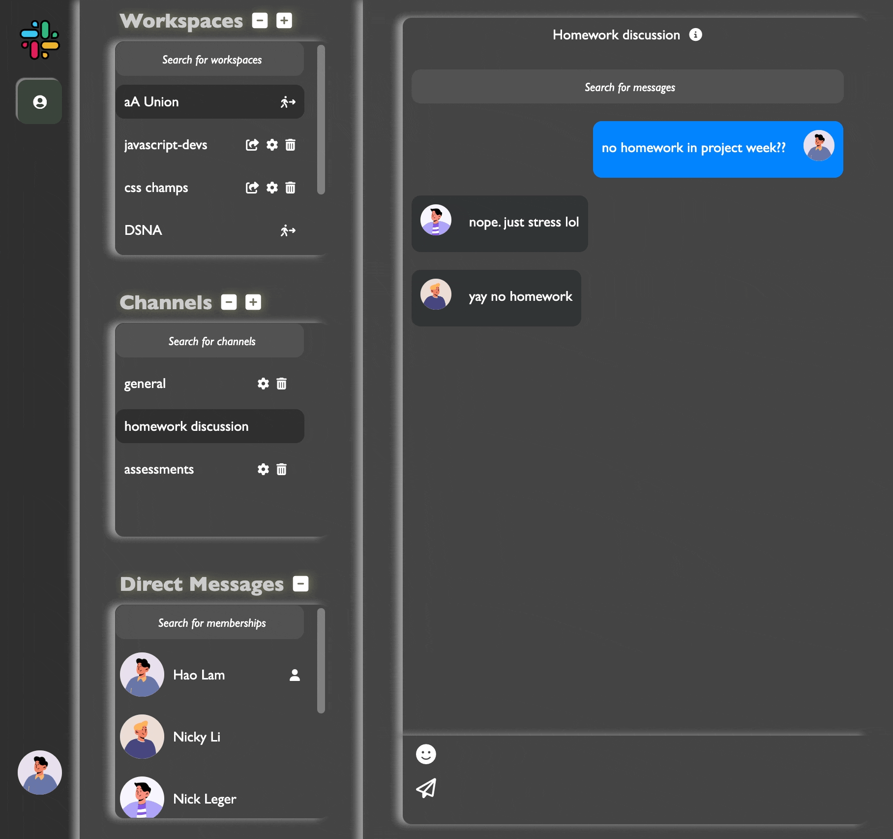

# 👨‍💻 About Me
Hello there! If you're reading this, chances are you're looking for someone who can code up a storm and tackle any challenge that comes their way. Well, look no further! I'm a versatile software engineer with a comprehensive skill set in both computer science and electrical engineering. Whether it's front-end, back-end, or game development, I've got you covered. I love diving into cutting-edge technology and learning new skills. In fact, I'm always on the lookout for my next exciting project. So, if you're interested in discussing how we can work together to make something awesome, let's chat!

# 🌐 Social

# 💻 Tech Stack

_Technologies that I used in various projects during my learning journey!_

# 💎 Projects
| Name | Link/Repo |Description | Features | Technologies |
|---------|-------|-------------|----------|--------------|
| **MiniAmazon**   |      | Inspired by the remarkable impact and success of Amazon in the online retail industry, MiniAmazon was built to replicate the essence of Amazon's success while catering to a more specific market or specific user needs. Miniamazon aims to provide a scaled-down yet effective platform for online shopping. | ✅ Orders   ✅ Checkout   ✅ Bookmark   ✅ Review   ✅ Searchbox   ✅ Chatbot   ✅ OAUTH   ✅ Product Magnifying   ✅ Simultaneous checkouts |                                   |
| **MiniSlack**    |      | Inspired by Slack's success in revolutionizing team communication and collaboration, MiniSlack comes into live with the goal of minimalist designs, focusing on creating real-time a messaging app using websocket. Similar to Slack, Minislack provides channels for organized discussions, direct messaging for one-on-one conversations. However, it distinguishes itself by emphasizing simplicity and efficiency. The interface is minimalist, focusing on essential functions to ensure a seamless user experience without unnecessary clutter.    Team Members: 🧑🏻 [Hao Lam](https://github.com/haolam05)  👧🏻 [Nicky Li](https://github.com/NickyViNi)  🧔🏻 [Nicholas Leger](https://github.com/leg-git-555) | ✅ Workspace   ✅ Channel   ✅ Message   ✅ Reaction   ✅ Searchbox ✅ Member |                           |
| **MiniMeetup**    |      | Inspired by the success of Meetup, MiniMeetup aims to replicate its community-building capabilities while emphasizing on providing a simple interface that prioritize user experience and accessibility. MiniMeetup ensures that the users can easily navigate the platform, discover events, and connect with others in their local communities without encountering unnecessary complexities. | ✅ Member   ✅ Group   ✅ Event   ✅ Venue   ✅ Live Chat   ✅ Google Map   ✅ Roles   ✅ Searchbox   ✅ Pagination ✅ Gallery   |                               |
| **BoomOnline**    |  | Welcome to 'Boom Adventure' – a Ruby-powered game that revives the classic 'Boom Online' experience with a fresh twist. Dive into solo battles, intense 1v1 duels, or team up to take on challenging bosses across 16 thrilling levels. Pause for strategic planning, groove to cool tunes, and choose from a variety of vibrant balloons and characters. With seamless gameplay and dynamic challenges, 'Boom Adventure' guarantees endless fun for all players! | ✅ Player   ✅ Solo   ✅ Team   ✅ Booms   ✅ Effects   ✅ Sound   ✅ Timer   ✅ Bosses   ✅ Special skills |       |

# 📊 GitHub Stats:
 
 

## 🏆 GitHub Trophies

### ✍️ Random Dev Quote

### 🔝 Top Contributed Repo

# 📈 Leetcode Stats

---

<!-- Proudly created with GPRM ( https://gprm.itsvg.in ) -->
